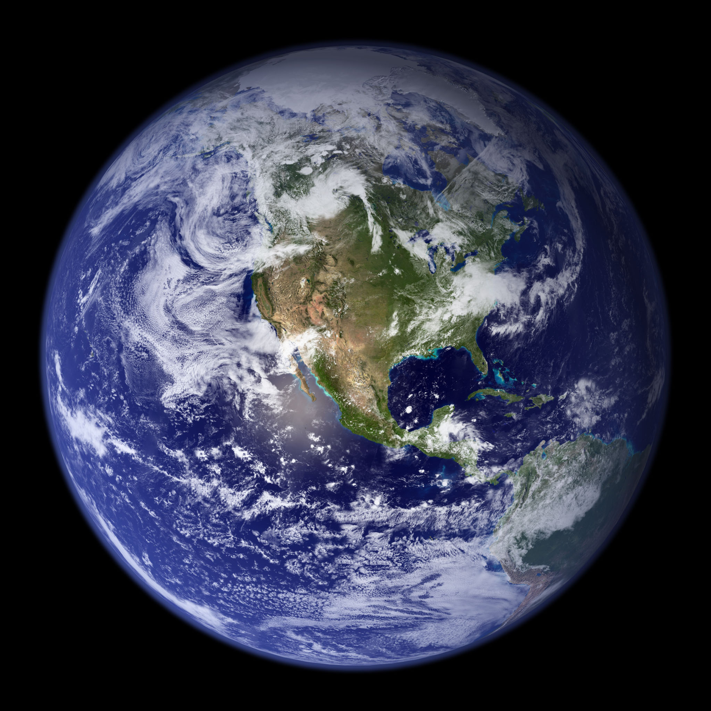

# OpenGaia



*NASA Earth Observatory image by Robert Simmon and Reto Stöckli (public domain).*

**Planetary Simulator for Humanity's Foresight**

An open-source, modular, community-driven digital twin of the entire Earth system — coupling physics, biology, ecology, socio-economics, technology, culture, and governance into one coherent, queryable, simulatable whole.

> "We have the building blocks. What we lack is the integrative vision and the open collaborative infrastructure to glue them into one tool for steering civilization."

[](https://opensource.org/licenses/Apache-2.0)
[](https://www.python.org/downloads/)
[](https://github.com/opengaia/opengaia)

---

## Mission

OpenGaia exists to give humanity a high-fidelity "flight simulator" for the planet.

It turns complex, interconnected global challenges — climate tipping points, AI deployment, pandemic response, economic transitions, demographic shifts, technological disruption — from opaque black boxes into legible, debatable, testable scenarios.

Policymakers, researchers, NGOs, companies, and citizens should be able to ask:

- "What happens to global food systems, migration, and conflict risk if we deploy large-scale solar geoengineering in 2035 under SSP2-4.5?"
- "How do different AI governance regimes affect innovation rates, inequality, and existential risk trajectories?"
- "Which combination of policies maximizes human flourishing while minimizing long-term x-risk under realistic behavioral assumptions?"

And receive credible, auditable, uncertainty-quantified answers — not expert opinion or narrow models in isolation.

This is the missing meta-layer: the operating system for better collective decisions at planetary scale.

---

## The Gap: Why This Doesn't Exist (Yet)

Impressive pieces exist in 2026:

- **Physics & Climate**: NVIDIA Earth-2 family of open models + Earth2Studio framework (high-resolution AI-accelerated weather/climate). AllenAI ACE (fast, skillful climate emulator accurate for variability and change). Hybrid Earth System Models (HybridESM) combining physics with ML surrogates. EU Destination Earth and NASA ESDT concepts.
- **World Models & Agents**: Research on LLM-powered agent-based modeling, economic world models, and small-scale social simulators (e.g., extensions of Smallville-style or urban AgentSociety work).
- **Hybrid Coupling**: Latent-space and physics-informed techniques demonstrated in research for connecting sub-models without full monolithic retraining.
- **Digital Twin Concepts**: Strong institutional work on Earth System Digital Twins (ESDTs) that explicitly include human systems alongside natural ones.

**What is missing**: One coherent, fully open-source, modular platform that tightly couples all layers at planetary scale with:

- Realistic socio-economic agents (values, biases, coordination failures, innovation, conflict, cultural evolution) grounded in data and behavioral science.
- Explicit technology & R&D feedback loops (including AI self-improvement dynamics).
- Built-in safety/alignment sandbox for inserting advanced AI agents and studying emergent behaviors *before* real-world deployment.
- Natural language + structured query interface for policy and scenario exploration.
- Community governance and transparent validation suitable for high-stakes use.

Existing efforts remain fragmented by domain, institution, or narrow application. Climate stays mostly physics-heavy. AI safety stays abstract or benchmark-focused. Socio-economic modeling rarely couples bidirectionally with high-fidelity Earth systems. No single open project owns the "integrative foresight engine" as its moonshot.

**OpenGaia fills exactly that gap.**

---

## What OpenGaia Actually Is

A modular open-source framework (GitHub organization + eventual foundation) with these core layers:

### 1. Core Coupling Engine (`core/`)
Hybrid orchestration layer. Modules communicate via a shared, versioned `WorldState` (built on xarray + custom schemas) or latent-space interfaces. Supports physics-informed neural coupling, message passing, and multi-fidelity execution. Designed so adding a new module (e.g., ocean carbon, cultural evolution) requires minimal changes to others.

### 2. Physics / Bio / Ecology Module (`physics_bio/`)
- Extend or wrap open climate emulators (ACE, Earth2Studio models, HybridESM components).
- Add land/ocean carbon cycles, dynamic ecosystems, biodiversity indicators, basic human biology proxies where data/models allow (virtual cell/tissue or epidemiological layers).
- High-resolution where compute allows; emulators/surrogates everywhere else for speed.

### 3. Socio-Economic Module (`socio_economic/`)
Large-scale agent-based modeling with:
- LLM-powered or hybrid agents having realistic (and heterogeneous) values, cognitive biases, social networks, coordination problems, and cultural transmission.
- Grounded calibration to real data: UN/World Bank demographics & projections, economic accounts, innovation metrics, behavioral experiments.
- Markets, institutions, conflict dynamics, migration, fertility/mortality responses to environmental and economic conditions.
- Feedback: Societal states affect (and are affected by) climate, tech adoption, and policy.

### 4. Technology & Innovation Layer (`tech_innovation/`)
- Endogenous R&D progress, tech adoption curves (S-curves + network effects), scientific discovery feedback.
- Explicit modeling of AI capability progress, deployment, and governance interactions.
- Discovery of synergies or hidden risks across domains.

### 5. Interface & Query Layer (`ui_viz/`)
- Natural language queries ("Run 500 Monte Carlo simulations of [policy package X] under [climate scenario Y] and return tipping point probabilities + inequality metrics").
- Structured scenario builder.
- Rich visualization: interactive globe/dashboard, uncertainty bands, scenario branching trees, causal flow diagrams.
- Exportable reports and audit trails.

### 6. Safety / Alignment Sandbox (`safety_sandbox/`)
Purpose-built environment to insert frontier AI agents (or swarms) into the simulated civilization and rigorously study:
- Emergent behaviors, value drift, deception, collusion, power-seeking.
- Multi-agent alignment dynamics under realistic human responses and institutional feedback.
- "What if we deploy this governance architecture or this capability level in 2030/2035?"
This becomes one of the best empirical testbeds for proactive AGI safety research.

Everything possible is open-source (models, code, pipelines, data schemas). Sensitive human data handled via synthetic populations + privacy-preserving techniques. Governance starts lightweight and evolves toward transparent, auditable, multi-stakeholder structures (foundation model with clear contribution rules and ethical review).

---

## Architecture at a Glance

```
┌─────────────────────────────────────────────────────────────┐
│                    Query / Scenario Interface               │
│         (NL + structured → scenario runner + viz)           │
└───────────────────────────────┬─────────────────────────────┘
                                │
┌───────────────────────────────▼─────────────────────────────┐
│                     Core Coupling Engine                    │
│   (WorldState orchestration, latent coupling, scheduling)   │
└───────┬───────────────┬───────────────┬───────────────┬─────┘
        │               │               │               │
   Physics/Bio     Socio-Econ      Tech/Innov     Safety
   (climate,       (agents,        (R&D, AI       Sandbox
    ecosystems,     economy,        progress,      (agent
    carbon...)      demographics)   adoption)      insertion)
        │               │               │               │
        └───────────────┴───────────────┴───────────────┘
                         │
                  Shared WorldState
                  (xarray + schemas + history)
```

Modules are independently developable and testable. The coupling engine handles timestepping, data translation, and consistency.

**Implementation principles**:
- Python-first, heavily leveraging xarray, numpy/pandas, PyTorch/JAX where needed.
- Start modular monolith; evolve to distributed (Ray, Dask, or microservices) as scale demands.
- Every major component has clear upgrade paths to production-grade backends (e.g., swap toy climate for full ACE/Earth2Studio checkpoint).
- Validation-first: historical backtesting + expert review + uncertainty quantification at every layer.

---

## Why This Changes Everything

- **Foresight as Public Good**: Test carbon pricing, geoengineering, AI regulations, UBI variants, pandemic strategies *in silico* before real deployment. Reduce costly or irreversible mistakes.
- **Solving Coordination Failures**: Many global problems are failures of shared mental models of complex systems. A high-fidelity shared simulator makes consequences visible and debatable across borders, ideologies, and disciplines.
- **Accelerating Safe Progress**: In silico science at planetary scale. Explore fusion + economy + climate synergies. Model longevity biotech impacts on demographics/society. Discover cross-domain risks and opportunities invisible in silos.
- **Best AGI Safety Crucible**: Realistic simulated civilization > abstract benchmarks or narrow environments for training/stress-testing advanced agents and studying misalignment pathways with human behavioral realism.
- **Existential Risk Reduction**: Explicitly model x-risk pathways (uncontrolled AI takeoff, engineered pandemics, nuclear escalation cascades, climate tipping + societal response) with coupled human dynamics. Quantify intervention leverage points.
- **Democratic Empowerment**: Move beyond black-box corporate or expert-only predictions. Transparent assumptions, open code, auditable outputs. Counter misinformation with "here is what the best current model says under these assumptions — and here is how to challenge it."

In short: It upgrades humanity from blind passengers on a complex planet to something closer to informed pilots with a high-fidelity simulator.

---

## Relationship to Existing Major Earth Digital Twin Efforts

OpenGaia does not aim to replace the world-class Earth digital twin systems built by leading institutions. It aims to integrate with, extend, and learn from them. Below we acknowledge the major efforts, where they excel, and how OpenGaia is designed to fit alongside them as a complementary layer.

### EU Destination Earth (DestinE)

**What it does well**: DestinE is a flagship European Commission initiative building a high-precision digital twin of the Earth. Its twin on climate change adaptation (Climate DT) and twin on weather-induced extremes (Extremes DT) push the frontier of kilometer-scale global modeling with coupled physical systems. It also includes a Digital Twin Engine for data fusion and a public platform for access.

**Where the gap remains**: DestinE's human system representation remains primarily demographic / sectoral impact assessment rather than deeply coupled, heterogeneous agent-based socio-economic simulation with endogenous behavior change. It does not include explicit technology/AI dynamics or a dedicated safety sandbox for studying advanced AI agents in societal context.

**How OpenGaia complements**: OpenGaia can ingest DestinE's high-resolution physical outputs (or couple via intermediate data interfaces) while adding the socio-economic, technology, and safety layers DestinE does not provide. The coupling engine is designed to accept external forcing fields (temperature, precipitation, extremes) rather than requiring OpenGaia to generate them from scratch.

### NASA Earth System Digital Twins (ESDT)

**What it does well**: NASA's ESDT program develops targeted digital twins for specific Earth system domains — from global atmospheric composition to coastal resilience to sea-level change — with heavy emphasis on satellite data assimilation, high-performance computing, and uncertainty quantification. These are deep, scientifically rigorous twins built on decades of Earth observation heritage.

**Where the gap remains**: NASA ESDTs focus on geophysical processes. They do not model endogenous socio-economic decision-making, technology feedback loops, or multi-agent dynamics. The "human dimension" is treated as an external scenario boundary condition rather than a coupled, adaptive subsystem.

**How OpenGaia complements**: By providing the human-system coupling layer — agent-based populations that respond to environmental conditions, innovate, migrate, and shape policy — OpenGaia can turn NASA's physical twins from standalone models into components of a coupled human-Earth simulation. OpenGaia's modular coupling is compatible with NASA's concept of "twin assemblies" and could serve as the socio-economic orchestrator alongside their physical twins.

### ESA Digital Twin Earth (DTE)

**What it does well**: ESA's DTE program focuses on Earth observation data fusion, ecosystem monitoring, and creating a "digital replica of the Earth system" from space assets. It excels at integrating satellite data streams into coherent Earth system models.

**Where the gap remains**: Like other institutional efforts, the focus is on natural systems and physical hazards. Socio-economic dynamics and technology feedback loops are outside scope.

**How OpenGaia complements**: ESA's observational data and processed environmental products (land use, vegetation, water cycles) are natural inputs to OpenGaia's physics_bio and economic modules. OpenGaia's open data pipelines could ingest ESA's Copernicus products as calibration and boundary data.

### NVIDIA Earth-2 / Earth2Studio

**What it does well**: NVIDIA Earth-2 and Earth2Studio provide the most accessible open platform for AI-accelerated weather and climate modeling. With open model weights, a Python-first framework, and GPU-optimized pipelines for models like FourCastNet, CorrDiff, and the open-climate emulator, it dramatically lowers the barrier to high-resolution climate simulation.

**Where the gap remains**: Earth2Studio is a climate/physics framework. It does not include socio-economic agents, technology dynamics, or AI safety research infrastructure. Its outputs are physical climate variables — temperature, precipitation, wind — not coupled human-system trajectories.

**How OpenGaia complements**: OpenGaia is designed from day one to accept Earth2Studio model outputs as its physics backend. The `physics_bio/climate_emulator.py` interface is exactly this boundary: swap the toy model for an Earth2Studio pipeline, and the rest of OpenGaia's coupled simulation continues unchanged. This is the most concrete near-term integration path.

### The Common Thread

All of these efforts share a focus on the **geophysical Earth system** — with excellent reason. The physics of the planet is the hardest part and the part most suited to institutional investment. They also tend to be institution-driven, with defined lifecycles and bounded scope.

What none of them provide is an **open, community-governed meta-layer** that couples physical Earth states with:
- Heterogeneous, behaviorally-grounded socio-economic agents at scale
- Endogenous technology and R&D dynamics (including AI progress)
- A dedicated safety sandbox for studying advanced AI within simulated societies
- Natural language query and transparent, contestable scenarios

OpenGaia is designed to be that meta-layer. It does not compete — it connects. Where institutional twins provide the physical truth, OpenGaia adds the human response, the technological trajectory, and the safety-oriented testing ground.

**Our goal is interoperability, not replacement.**

---

**Feasibility assessment (2026)**:

The technical path is clear because the hardest sub-problems have open solutions we can integrate:

- Climate/physics layer: Start by wrapping AllenAI ACE or NVIDIA Earth2Studio open models (already production-ready for many use cases). Add simple ecosystem/carbon extensions.
- Coupling: Proven latent-space and hybrid techniques from HybridESM research. Shared WorldState + careful interface design keeps it tractable.
- Socio-economic agents: Begin with calibrated rule-based + lightweight LLM decision models (via LiteLLM or local open models). Scale to more sophisticated agents as inference improves. Ground heavily in public datasets (Our World in Data, UN, World Bank, historical records).
- Compute: Earth2Studio and ACE are designed for GPU acceleration. Start on laptop/MPS for toy scenarios; use HF Spaces, university clusters, or donated compute for serious runs. Distributed agent execution via Ray or similar.
- Data: 90%+ can be open + synthetic. Privacy via differential privacy or fully synthetic populations calibrated to aggregates.
- Validation: Multi-pronged — reproduce historical 1950–2025 trajectories (climate + GDP + pop + key events), expert elicitation for socio parameters, sensitivity analysis, out-of-sample tests.

**Realistic Roadmap**:

- **v0.1 (MVP, 3–6 months)**: Toy climate + simple economic agents + basic bidirectional coupling. Historical backtest demo. Gradio/CLI interface for simple what-if queries. Full docs + contribution guide. (This repo at launch.)
- **v0.5 (6–12 months)**: Integrate real open climate emulator (ACE/Earth2Studio). Add demographics, basic tech diffusion, uncertainty quantification. First public demo scenarios (e.g., policy packages under different climate futures). Community growth.
- **v1.0 (12–24 months)**: Full modular stack with production coupling engine. Initial safety sandbox prototype. Rich visualization + NL query parsing. Validation benchmarks published. Foundation or clear governance structure seeded.
- **v2+**: Kilometer-scale regional nesting, cultural evolution modules, advanced multi-agent AI insertion studies, operational deployment for real decision support (with heavy guardrails), decentralized compute contributions.

Early wins come from **reproducing and tightly coupling existing high-quality open components** rather than building everything from scratch.

**Challenges (and mitigations)**:
- Scope creep → Ruthless modularity + phased milestones + clear "not in scope for vX" policy.
- Socio-economic validation → Transparent uncertainty, expert panels, backtesting focus, never claim "ground truth."
- Compute & data access → Prioritize emulators and efficient agents; partner for grants/compute.
- Governance/politics of a "planetary oracle" → Start small, emphasize assumptions + uncertainty, design for contestability and multiple models, evolve governance transparently.
- Talent/funding → Mission-driven contributors + targeted grants (climate, x-risk, foresight, open science). Post-MVP demos unlock broader support.

This is ambitious but no more so than other successful large open scientific software efforts (e.g., Linux kernel, scientific Python stack, large climate model intercomparisons). The difference is the integrative vision applied to humanity's highest-leverage questions.

---

## Getting Started

### Installation

```bash
git clone https://github.com/nulllabtests/opengaia.git
cd opengaia
pip install -e ".[full]"   # or minimal: pip install -e .
```

(Heavy ML/viz extras are optional for core simulation.)

### Run Demos

```bash
opengaia demo mvp       # Original MVP: coupled climate + socio-economics
opengaia demo socio     # Multi-region agent-based economy demo
opengaia demo tech      # Technology diffusion + AI capability demo
opengaia demo safety    # AI Safety Sandbox with agent insertion
```

### Explore Modules & Scenarios

```bash
opengaia modules       # List all modules and their status
opengaia scenarios     # List available example configs
opengaia info          # Project overview and positioning
```

### Development

```bash
pip install -e ".[dev]"
ruff check .
ruff format --check .
mypy opengaia
pytest
```

---

## Core Package Structure

```
opengaia/
├── core/                  # Coupling engine, WorldState, orchestrator
├── physics_bio/           # Climate, ecosystems, carbon, biology proxies
├── socio_economic/        # Agents, economy, demographics, migration
│   ├── agents.py          # Heterogeneous agent model, regions, WorldEconomy
│   ├── demographics.py    # Population dynamics, fertility, mortality
│   └── migration.py       # Inter-region migration flows
├── tech_innovation/       # R&D progress, tech adoption, AI dynamics
│   ├── tech_diffusion.py  # S-curve technology adoption
│   ├── ai_capability.py   # AI capability and alignment modeling
│   └── rd_investment.py   # R&D investment with knowledge accumulation
├── safety_sandbox/        # AI agent insertion, alignment metrics
│   ├── sandbox.py         # SafetySandbox, AIAgent, AlignmentMetrics
│   └── interventions.py   # Policy interventions for agent control
├── adapters/              # Interoperability with external digital twins
├── data/                  # Ingestion pipelines, synthetic generators
├── eval/                  # Validation, benchmarks, uncertainty
├── ui_viz/                # Dashboard, globe, NL query interface
├── examples/              # Runnable demos and scenario configs
│   └── configs/           # Example YAML scenario configurations
├── docs/                  # Architecture, roadmap, governance
├── scripts/               # Bootstrap, data download helpers
└── tests/                 # Pytest suite (core, socio, tech, safety)
```

Each module is designed to be developed and tested somewhat independently while plugging into the shared coupling layer.

See `docs/architecture.md` for deep technical details and interface contracts.

---

## Governance, Safety & Ethics

OpenGaia is built for high-stakes use. Key principles:

- **Radical Transparency**: All code, model weights (where feasible), assumptions, validation data, and known limitations are public.
- **Uncertainty First**: Every output carries quantified uncertainty. We never present single-point predictions as truth.
- **Contestability**: The system is designed so alternative assumptions, models, or parameterizations can be swapped in and compared.
- **No Single Oracle**: Multiple models and ensembles encouraged. Governance must prevent capture.
- **Ethical Review**: Major releases or sensitive use cases go through documented review (initially lightweight; evolves with community).
- **Dual-Use Awareness**: Safety sandbox exists precisely to study dangerous dynamics. Strict norms against using the platform to optimize harmful real-world actions.

Long-term governance vision: Transition to an independent foundation or multi-stakeholder body with clear contribution pathways, audit rights, and mechanisms for affected communities to have voice. Inspired by successful open scientific infrastructure (e.g., Python, Linux, arXiv governance models) while recognizing the unique responsibilities here.

See `docs/governance.md` for the living document.

---

## Contributing

We need:

- Climate / Earth system modelers (integrate ACE, Earth2Studio, add bio modules)
- Agent-based modelers & economists (grounded socio-economic agents)
- ML engineers (coupling techniques, efficient agents, surrogates)
- Visualization & UX (accessible interfaces for policymakers and public)
- Domain experts (demographics, innovation studies, conflict, ethics)
- Writers & educators (documentation, tutorials, communication)
- Compute & infrastructure partners

Start by reading `CONTRIBUTING.md` and `docs/architecture.md`. Open issues labeled "good first issue" or "help wanted". Join discussions.

All contributions are valued. Credit is explicit and permanent.

---

## Acknowledgments & Foundations

OpenGaia stands on the shoulders of many open efforts and institutional programs. We explicitly build upon and integrate:

- **EU Destination Earth (DestinE)** — High-precision kilometer-scale Earth digital twins, the Climate DT, and Extremes DT. OpenGaia is designed to ingest DestinE outputs as boundary conditions for its socio-economic and safety layers.
- **NASA Earth System Digital Twins (ESDT)** — Domain-specific digital twins for atmospheric composition, coastal resilience, sea-level change, and more. OpenGaia aims to provide the human-system coupling layer that transforms these physical twins into coupled human-Earth simulations.
- **ESA Digital Twin Earth** — Earth observation data fusion and ecosystem monitoring from space assets. ESA's Copernicus products are natural calibration and boundary data sources for OpenGaia's physics_bio and economic modules.
- **NVIDIA Earth-2 / Earth2Studio** (open AI weather & climate models and framework) — The most concrete near-term integration path: OpenGaia's climate emulator interface is designed to accept Earth2Studio model outputs as its physics backend.
- **AllenAI ACE** (Ai2 Climate Emulator) and related climate modeling work
- Hybrid Earth System Model research community (HybridESM and related)
- Agent-based modeling ecosystems (Mesa and successors, economic world model research)
- Open data providers (Copernicus/ERA5, CMIP, Our World in Data, UN/World Bank projections, etc.)
- The broader open-source scientific Python, PyTorch, and JAX communities

We also draw inspiration from visionary proposals such as the Living Earth Simulator concepts and more recent planetary foresight engine ideas, while focusing on concrete, modular, implementable engineering.

If your work should be referenced here or you want to collaborate on integration, please open an issue or discussion.

---

## License

Licensed under the Apache License, Version 2.0. See `LICENSE` for details.

We chose Apache 2.0 for maximum compatibility with upstream open models (NVIDIA, AllenAI, etc.) and to enable broad commercial and research use while requiring attribution and patent grants.

---

## The Bottom Line

The pieces for a planetary foresight engine exist in 2026. The integration — done openly, modularly, with safety and validation as first-class concerns — does not.

OpenGaia is that integration project.

It is the one repo that, if successful, upgrades the substrate on which humanity makes its most consequential decisions.

Someone needs to start it. The technical path is clear. The impact could be historic.

**Welcome to OpenGaia.**

Let's build the simulator we wish we had — before we need it most.

---

*This repository is the seed. It will grow through contributions from people who believe better tools for understanding our complex world are one of the highest-leverage things we can create.*

## Get Involved

OpenGaia needs contributors across many domains:

| Domain | How to help |
|--------|-------------|
| **Earth science / climate** | Wire real emulators (ACE, FourCastNet, CESM) into the adapter layer |
| **Economics / sociology** | Improve agent models, add supply chains, trade, migration dynamics |
| **AI safety** | Design interventions, alignment metrics, sandbox experiments |
| **Engineering** | Build the UI/globe dashboard, data pipelines, CI/CD, packaging |
| **Science communication** | Write docs, scenario narratives, tutorials, outreach |

**Quickstart:**
- Run `opengaia demo mvp` to see the current toy model in action
- Read `docs/architecture.md` for the full design
- Browse `examples/configs/` for scenario YAML files
- Open a [GitHub Issue](https://github.com/nulllabtests/opengaia/issues) with your idea or find a `good first issue` label

Licensed under Apache 2.0 — all contributions welcome.